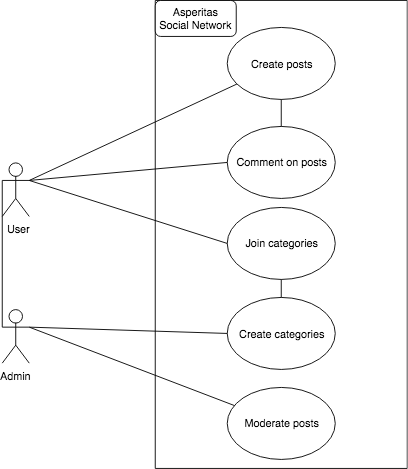

# Asperitas Social  Network

## Project Abstract
This project aspires to be a full-stack reddit clone who prioritizes free speech, efficient load times, and minimal ad exposure. The project is written by user d3zb6z and uses Node.js, mongoose, and React+Redux. The program is currently allows users to create accounts that can create posts and comments in pre-made categories on the site. The code is well-maintained, as it has generally positive comments from a post on the React project reddit. https://www.reddit.com/r/reactjs/comments/arox51/i_made_a_barebones_fullstack_reddit_clone_to/

## Project Relevance
This project fulfills many of the educational criteria for this course. At the very minimum, this project concentrates on object-oriented design, databasing, improving the graphic user interface, a need for testing and debugging the project, and  a need for algorithmic optimization. This project is already a lot of files and it would be useful to create UML diagrams to help people understand the flow of the code, as well as a well-documented readme in order to let new users understand our assignment.

## Conceptual Design
This project needs to be improved in four ways: sorting, pagination, infinite-scroller, and categories. I will go over a gist of what the project owner is expecting. For sorting, you need to be able to sort posts by the option to sort by 'new', 'top', maybe 'controversial' and 'hot' as well. This is very similar to the sort button on reddit. For pagination, the app currently shows every post in a category, however the project owner would like for the number of posts shown to be dependent on if you scroll down the page. For categories, you need to be able to create new sub-categories that aren’t hard-coded into the app already, and possibly assign levels of authority such as admin, group member, etc. Finally, for posts you need to be able to just post posts with text rather than requiring all posts to contain a link.
## Background
https://www.reddit.com/r/reactjs/comments/arox51/i_made_a_barebones_fullstack_reddit_clone_to/
https://github.com/d11z/asperitas
https://asperitas.now.sh/

## Required Resources
- Group members
- Hardware and software resource required
